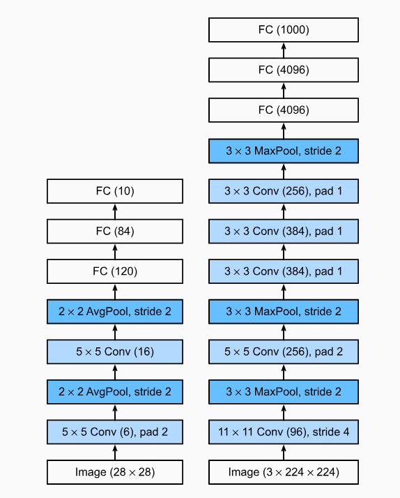

# LeNet v5 & friends

Various variants of LeNet v5 & friends


## LeNet v5 (Anno 1995)

The classic (original) LeNet v5
has two convolutions layers
and uses tanh activation and average pooling.


A more "modern" version
changes tanh activation to relu and
average pooling to max pooling.

Another variant adds a third convolution layer
WITHOUT pooling that gets  16 channels with 5x5 input
and outputs 120 filters (channels) with kernel size 5x5 resulting in 1x1
(that is, single pixel feature maps) => (120,1,1).


Note: All these variants
have a total of 61_706 parameters.
About 0.23 MB or 240.10 KBs (if you assume 4 bytes for a float32 for a parameter).

The biggie is the fully connected 400 (16x5x5) to 120 layer
with 400*120 parameters, that is, 48_000 (plus 120 biases).

The summary of the classic model reads:

```
----------------------------------------------------------------
        Layer (type)               Output Shape         Param #
================================================================
            Conv2d-1            [-1, 6, 28, 28]             156
         AvgPool2d-2            [-1, 6, 14, 14]               0
            Conv2d-3           [-1, 16, 10, 10]           2,416
         AvgPool2d-4             [-1, 16, 5, 5]               0
            Linear-5                  [-1, 120]          48,120
            Linear-6                   [-1, 84]          10,164
            Linear-7                   [-1, 10]             850
================================================================
Total params: 61,706
```


History Trivia Corner - back in the days of LeNet v1 training took days and
in the days of LeNet v5 (still) many hours.
Nowadays a training run of one epoch takes a couple of seconds
on a vanilla computer.

Back in the days getting LeNet v5 up and running
might take weeks of research and programming effort
(without today's deep learning libraries/tools
with tensors, auto gradients / differentiation,
data loaders, and much more).

Today LeNetv5 is the hello world sample in
[the pytorch 60 minute introduction blitz](https://pytorch.org/tutorials/beginner/blitz/neural_networks_tutorial.html)
and beginners get up and running in minutes!


## Sample Scripts

Step 0:  To download the MNIST dataset - 60000 (grayscale) images in 28x28 (and labels) for training and 10000 for testing - use:

    $ python ./prepare.py


### Print the Neural Network Model Summaries

To print the model summaries use:

    $ python ./models.py

See [SUMMARY.md](SUMMARY.md) for sample output.


### Train the Model (& Save the Weights)

To train a model use:

    $ python ./train.py

Note - at the end of the training (default is 10 epochs)
the weights (& biases) get saved to `lenet5.pth`


### Eval(uate) the Model (& Load the Weights)

To eval(uate) the trained model use:

    $ python ./eval.py


That's it.


## Bonus - AlexNet (Anno 2012) - From 61,706 Weights to 61,100,840


The award-winning AlexNet is basically a LeNet5 scaled up 1000x and
introduces relu activation, dropout layers, and more to the world (of deep neural networks).



> AlexNet is much deeper than the comparatively small LeNet-5.
> AlexNet consists of eight layers: five convolutional layers,
> two fully connected hidden layers, and one fully connected output layer.


The summary of the model reads:


```
----------------------------------------------------------------
        Layer (type)               Output Shape         Param #
================================================================
            Conv2d-1           [-1, 64, 55, 55]          23,296
              ReLU-2           [-1, 64, 55, 55]               0
         MaxPool2d-3           [-1, 64, 27, 27]               0
            Conv2d-4          [-1, 192, 27, 27]         307,392
              ReLU-5          [-1, 192, 27, 27]               0
         MaxPool2d-6          [-1, 192, 13, 13]               0
            Conv2d-7          [-1, 384, 13, 13]         663,936
              ReLU-8          [-1, 384, 13, 13]               0
            Conv2d-9          [-1, 256, 13, 13]         884,992
             ReLU-10          [-1, 256, 13, 13]               0
           Conv2d-11          [-1, 256, 13, 13]         590,080
             ReLU-12          [-1, 256, 13, 13]               0
        MaxPool2d-13            [-1, 256, 6, 6]               0
AdaptiveAvgPool2d-14            [-1, 256, 6, 6]               0
          Dropout-15                 [-1, 9216]               0
           Linear-16                 [-1, 4096]      37,752,832
             ReLU-17                 [-1, 4096]               0
          Dropout-18                 [-1, 4096]               0
           Linear-19                 [-1, 4096]      16,781,312
             ReLU-20                 [-1, 4096]               0
           Linear-21                 [-1, 1000]       4,097,000
================================================================
Total params: 61,100,840
```


